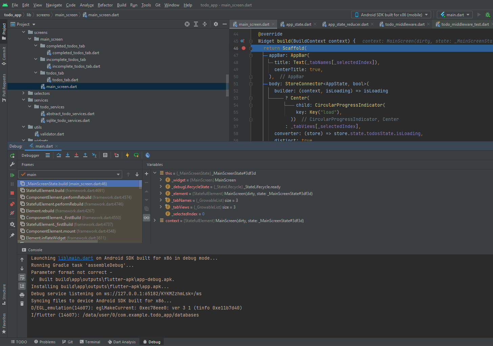

# Debugging

## DevTools

DevTools is a powerful tools run in browsers which support variety of features:

- source-level debugger

- widget inspector that displays a visual widget tree, and “widget select” mode where we select a widget in the app and it drills down to that widget in the tree

- memory profiler

- timeline view that supports tracing, and importing and exporting trace information

- logging view

  

  

## Setting breakpoints
- We can set breakpoints in our IDE. For example in android studio:


- And when we run the app in debug mode the app will stop at the breakpoint that was set.



- In here, we will can look at variables value to find out where make bugs.

## The Dart analyzer

- If we're using [Flutter enabled IDE/editor](https://flutter.dev/docs/get-started/editor), the Dart analyzer is already checking our code and looking for possible mistakes:


- If not we can run flutter analyze
- Dart analyzer help us to prevent some annotation bugs by avoiding `var`, untyped arguments, untyped list literals, and so on.

## Logging

Another useful debugging tool is logging. From logging, we can read stack trace of an exception, our `print()` logging in the console.


## Assertions

- During development, we can also use `assert` to detect unexpected value of a variable.


- When an unexpected value appeared, it's reported to the console.

## Debugging animations

The easiest way to debug animations is to slow them down. We can slow animations down by 2 ways:

- By DevTools inspector:


This will make animations slower than normal 5 times

- By code:

> ```dart
> import 'package:flutter/scheduler.dart';
> 
> void setSlowAnimations() {
>   timeDilation = 5.0;
> }
> ```

We can adjust how many times slower we want.

 


## Measuring app startup time

- To gather detailed information about app startup time we can run:

  `flutter run --trace-startup --profile`

- Then the trace output will be saved as a JSON file called `start_up_info.json` with content:

> ```
> {
>   "engineEnterTimestampMicros": 96025565262,
>   "timeToFirstFrameMicros": 2171978,
>   "timeToFrameworkInitMicros": 514585,
>   "timeAfterFrameworkInitMicros": 1657393
> }
> ```

## Tracing Dart code

- To perform a performance trade, we can use DevTools Timeline view


- We should run this Timeline in profile mode to ensure the runtime performance characteristics closely matches that of your final product.

## Performance overlay

- We can show performance overlay by:

> ```dart
> class MyApp extends StatelessWidget {
>   @override
>   Widget build(BuildContext context) {
>     return MaterialApp(
>       showPerformanceOverlay: true,
>       title: 'My Awesome App',
>       theme: ThemeData(
>         primarySwatch: Colors.blue,
>       ),
>       home: MyHomePage(title: 'My Awesome App'),
>     );
>   }
> }
> ```


